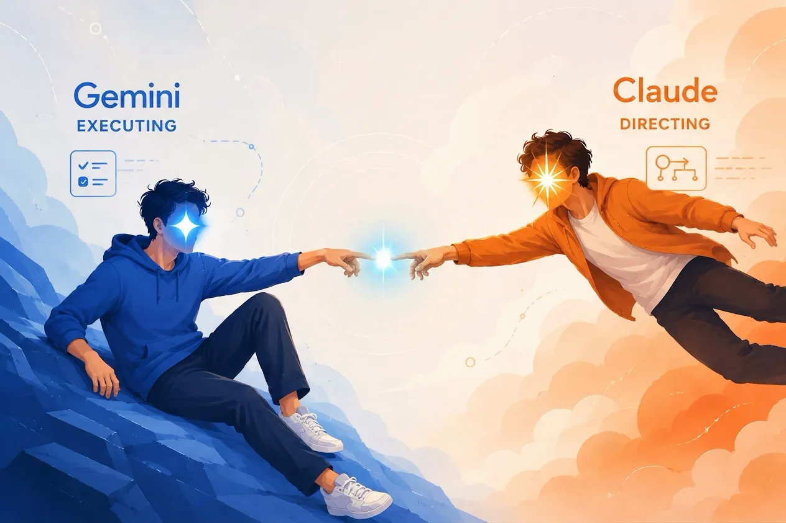

<div align="center">

# 🛰️ Antigravity for Claude Code and Codex

**Run the Antigravity CLI (Gemini) as a collaborating worker from Claude Code or Codex.**

Claude or Codex conducts the judgement; Gemini does the heavy lifting.

</div>

---

## What this repository does

This plugin lets Claude Code and Codex delegate suitable work to the Antigravity CLI (`agy`). It keeps the existing delegation, scouting, review, background-job, media, trace, doctor, migration, Cloud-debug, and cost tools while adding a native Codex MCP surface.

Native Windows headless calls use the bundled `agy-headless-bridge` v1.2.1 source through Windows ConPTY. The bridge does not need to be installed separately.

## Requirements

- [Antigravity CLI](https://antigravity.google/docs/cli-using) (`agy`), installed and authenticated
- [Claude Code](https://docs.anthropic.com/en/docs/claude-code), Codex, or both
- Python 3.9 or newer
- [pywinpty](https://pypi.org/project/pywinpty/) on native Windows
- Git Bash, normally installed with [Git for Windows](https://git-scm.com/download/win), because the existing wrappers are Bash scripts

Install the only Python runtime dependency needed on native Windows, then authenticate `agy` once:

```powershell
py -3 -m pip install -U pywinpty
agy
agy models
```

## Claude Code installation

Run inside Claude Code:

```text
/plugin marketplace add GryAsl/antigravity-for-claude-code-and-codex
/plugin install antigravity@antigravity-for-claude-code-and-codex
/antigravity:setup
```

The existing slash commands, skill, custom agent, hooks, wrapper behavior, model tiers, timeouts, structured output, exit codes, and opt-in `--yolo` behavior are preserved.

## Codex installation

```powershell
codex plugin marketplace add https://github.com/GryAsl/antigravity-for-claude-code-and-codex
codex plugin add antigravity@antigravity-for-claude-code-and-codex
```

Start a new Codex task after installation. The plugin exposes direct MCP tools for delegate, scout, review, research, media, jobs, trace, doctor, migrate, cloud-debug, and cost operations. Review and trust the optional non-blocking reminder hook with `/hooks`; Codex intentionally does not trust plugin hooks automatically.

## Usage

Claude Code can use the existing commands:

```text
/antigravity:delegate --tier flash "Implement the tests for this module"
/antigravity:review
/antigravity:research "Research this topic and include sources"
```

Codex uses the corresponding `antigravity` MCP tools directly. The thin MCP adapter invokes the same wrappers and returns their stdout, stderr, and exact exit code.

The wrappers remain available from Git Bash:

```text
agy-delegate --tier flash --dir "C:\path\to\repo" --digest "Inspect the project"
agy-scout --dir "C:\path\to\repo" "Trace the request flow"
agy-review --dir "C:\path\to\repo" --staged --goal "Implement feature X"
```

For write-capable tasks, use a trusted branch and grant only the permissions you intend. `--yolo` grants broad access to files, commands, network, and process-visible credentials; its behavior is unchanged and it is not enabled by default.

If something fails, run `/antigravity:setup`, the Codex `doctor` MCP tool, or `agy-doctor`, then see [troubleshooting](docs/TROUBLESHOOTING.md).

## License

[MIT](LICENSE). Third-party attributions are in [THIRD_PARTY_NOTICES.md](THIRD_PARTY_NOTICES.md). This is a community project and is not affiliated with Google, Anthropic, or OpenAI.
